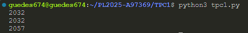

# Somador On/Off
**Data:** 9 de Fevereiro de 2025

# Autor
**Nome:** Tiago Matos Guedes
**Número:** a97369

## Resumo
Este programa tem como objetivo somar sequências de dígitos num dado texto passado como argumento seguindo as seguintes regras:
- O programa começa com a soma ligada mas pode ser controlada através dos controlos "On" e "Off" em qualquer combinação de letras, maiúsculas ou minúsculas.
- O sinal de "=" faz com que seja imprimida para o stdout o resultado até ao próprio caratér.

## Lista de Resultados
- [Código Python](tpc1.py)

## Exemplo de input para teste
```sh
"Hoje, 7 de Fevereiro de 2025, o professor de Processamento de Linguagens deu-nos este trabalho para fazer.=OfF E deu-nos 7= dias para o fazer... ON Cada trabalho destes vale 0.25 valores da nota final!"
```

## Output do teste
