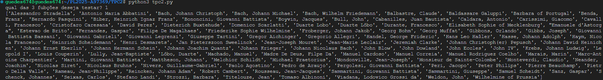

# Análise de um dataset de obras musicais 

## Autor
- Nome : Tiago Matos Guedes
- Número : A97369

## Resumo
### Requisitos

Neste TPC foi pedido que fosse analizado um ficherio CSV e que, sem utilizar o módulo CSV do python fosse possível apresentar:

1. Lista ordenada alfabeticamente dos compositores musicais;
2. Distribuição das obras por período: quantas obras catalogadas em cada período;
3. Dicionário em que a cada período está a associada uma lista alfabética dos títulos das obras
desse período.

### Solução

Foi implementada uma função que separa cada linha do csv em tokens, assim como dentro de cada linha por cada ; separa em outro token, e depois é feita a devida caracterização por atributo do dataset, ignorando o segundo atributo, desnecessário para as queries.
Depois sim a implementação das devidas queries, uma por uma, tendo acesso ao dicionário criada pela função principal.

## Lista de Resultados

- [tpc2.py](tpc2.py)

## Output de teste da query 1

## Output de teste da query 2

## Output de teste da query 3
