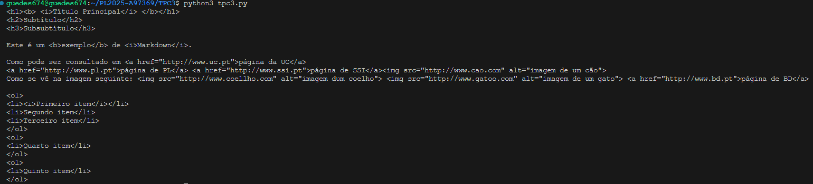

# Conversor de MarkDown para HTML

## Autor
- Nome : Tiago Matos Guedes
- Número : A97369

## Resumo
### Requisitos

Neste TPC foi solicitado que fosse analisado um ficheiro markdown e que fosse convertido para HTML.

### Solução

Foi implementada uma função para cada tipo de situação que possa aparecer em markdown (apenas as indicadas no enunciado), como para links, imagens, titulos, itálico, etc...
E depois feita uma função geral que por cada linha do texto passado como argumento, fazia as verificações de todos os tipos de situações que se podia encontrar, tratando de forma diferente as listas, que eram tratadas da forma seguinte:
1. Era verificada se a linha começava com um número e um. seguidos, (adicionalmente um espaço ou não), e se assim fosse iniciava-se uma lista e esse elemento era adicionada ao buffer de listas.
2. Percorria as linhas até encontrar um elemento que não seja do formato de lista.
3. Encontrado esse elemento, a lista era convertida para string separada por \n's e passada como argumento á função de listas.

## Lista de Resultados

- [tpc3.py](tpc3.py)

## Output de teste

