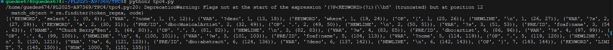

# Analisador Léxico de Queries

## Autor
- Nome : Tiago Matos Guedes
- Número : A97369

## Resumo
### Requisitos

Neste TPC foi solicitado que fosse feito um analisador léxico de uma linguagem típica de queries.

### Solução

Foi implementado um analisador léxico que consistiu numa criação de uma lista de tokens cujo cada token tem um identificador que vai estar associado ao token propriamente dito. Depois disso é efetuado a conversão para um dicionário e posteriormente para uma lista, contendo a informação não só do token e qual o seu identificador mas também a linha onde se encontra e entre que colunas está compreendido (através da função span).

## Lista de Resultados

- [tpc4.py](tpc4.py)

## Output de teste
