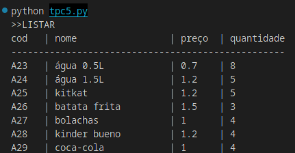
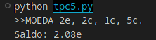
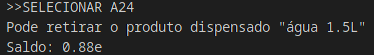

# Vending Machine

## Autor
- Nome : Tiago Matos Guedes
- Número : A97369

## Resumo
### Requisitos

Neste TPC foi solicitado que fosse feito uma vending machine.

### Solução

Foi implementado um analisador léxico (tokenizador) com os devidos tokens para a linguagem da vending machine em questão, tendo desta forma uma lista de tokens com o seu identificador e a respetiva expressão regular. Com isso, e tratando dessa forma o programa, torna-se fácil a implementação do objetivo. Pela função main foi feita a devida divisão pelas diversas funcionalidades da vending machine, podendo listar os itens que a máquina contem, podendo carregar a máquina com as moedas permitidas, selecionar o item que o cliente deseja e sair, guardando o stock dos items num ficheiro .json denominado stock.json.

## Lista de Resultados

- [tpc5.py](tpc5.py)

## Output de teste
# Funcionalidade de listar

# Funcionalidade de adicionar moeda

# Funcionalidade de selecionar item
