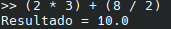
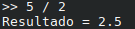

# Analisador Sintático Matemático

## Autor
- Nome : Tiago Matos Guedes
- Número : A97369

## Resumo
### Requisitos

Neste TPC foi solicitado que fosse desenvolvido um analisador sintático para expressões matemáticas.

### Solução

Foi implementado um analisador sintático para expressões matemáticas simples, com parênteses e considerando apenas a precedência de todas as operações. Também foi criado o analisador léxico, que fornece a lista de tokens necessária para o funcionamento do analisador sintático e atribuição de semântica, quando aplicável. A lógica utilizada foi baseada na fornecida na aula teorica pelo professor, utilizando uma gramatica simples, disponivel nos comentários do analisador sintático. O formato dos ficheiros é muito semelhante ao utilizado pelo professor na aula pois baseei-me nele para este, alterando a logica das listas para a logica de expressões.

## Lista de Resultados

- [tpc6.py](tpc6.py)

## Output de teste
# Exemplo 1

# Exemplo 2

# Exemplo 3
